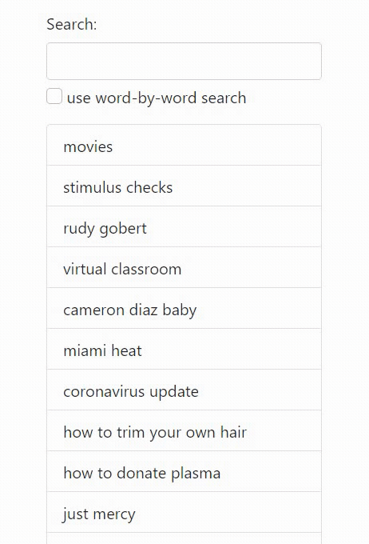
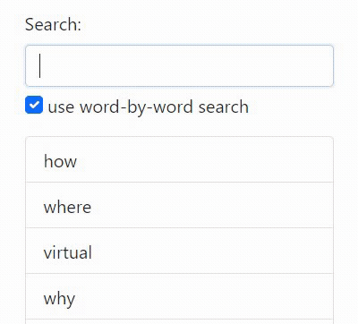

# elasticsearch-next-word-demo
This repo is meant to accompany my tutorial on [word-by-word autocomplete using Elasticsearch and Painless scripting here]

If you have Go and Elasticsearch installed, you should be able to run this and be good to go!
```
# in one terminal
bin/elasticsearch

# in another terminal
go run main.go populate data/data.txt
go run main.go
```

## Summary
Normal autocomplete (i.e. Google search) usually completes the full phrase like this, which may have results with the same first few words:



While word-by-word autocomplete (i.e. smartphone keyboards) trades off having to click/type more, but deduplicates common words in the beginning:

